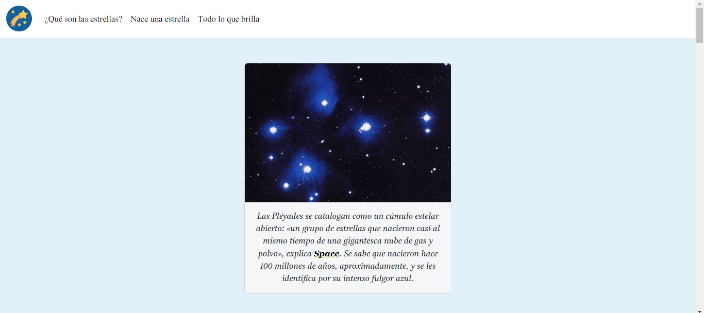
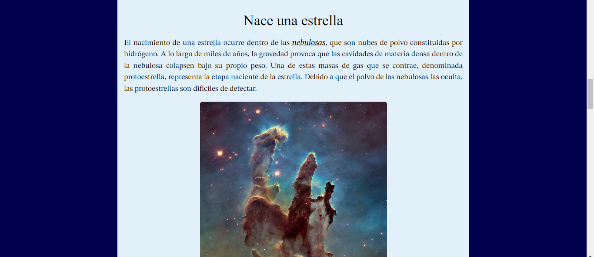
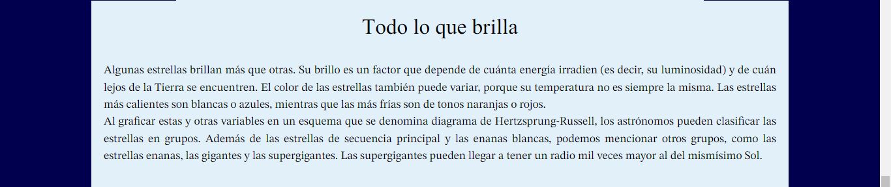

# Página Web
👩🏽‍💻 Página web creada con HTML5, CSS3 y Bootstrap 5 👩🏽‍💻
# Introducción 📖
Este proyecto consistió en una práctica realizada en el bootcamp de TECNOLOchicasPRO, donde se pusieron a prueba mis habilidades en tecnologías como HTML5 para dar estructura a la página, CSS3 para dar estilo a la página y Bootstrap 5.
## ¿Qué construí? 🧱
Se construyó una página web que lleva como tema principal la Astronomía, en la cuál yo me enfoque en el tema de las estrellas, *Estrellas: ¿qué son?*

La página se encuentra dividida en 5 secciones:

1. Primera parte de la página web

2. ¿Qué son las estrellas?

3. Nace una estrella

4. Todo lo que brilla
.

5. Información de contacto
.

## Demo 💻
Puedes entrar a ver el demo en el siguiente vínculo [Estrellas: ¿qué son?](https://estrellas-paginaweb.netlify.app/)

